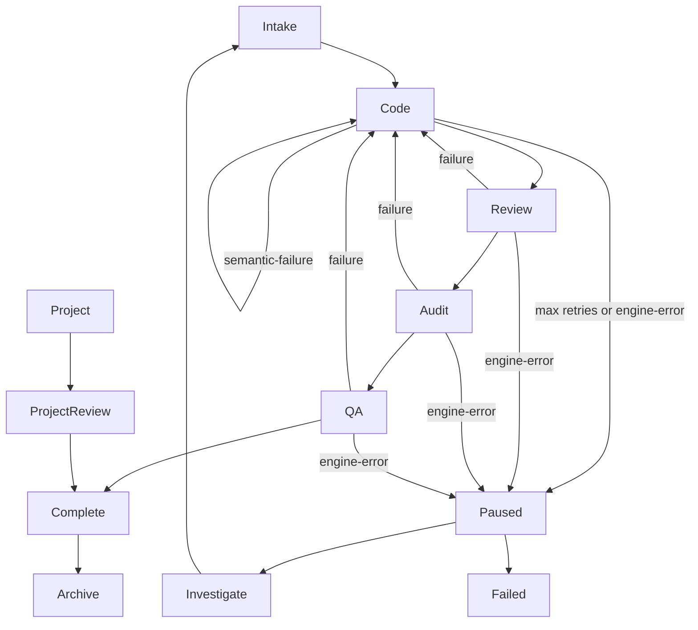
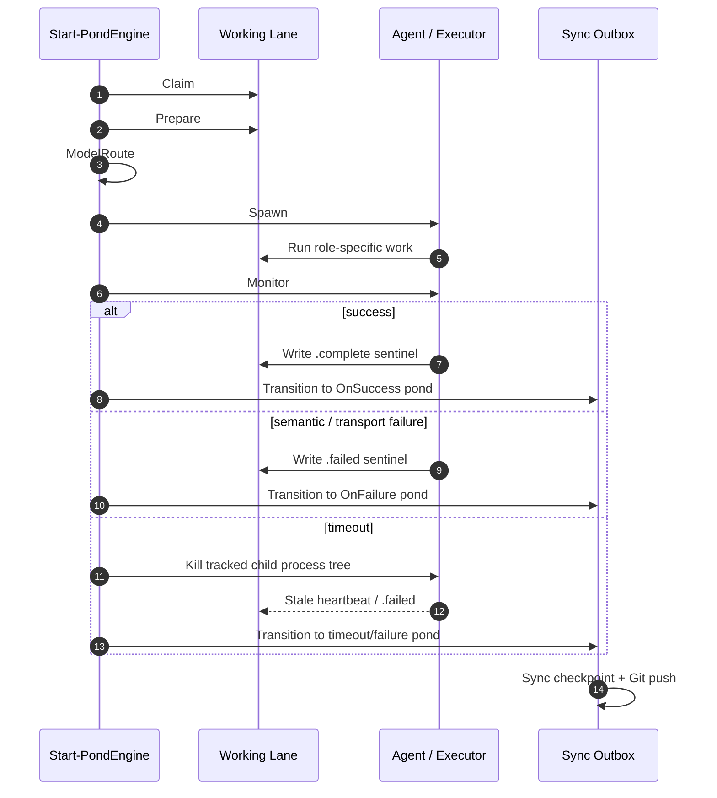
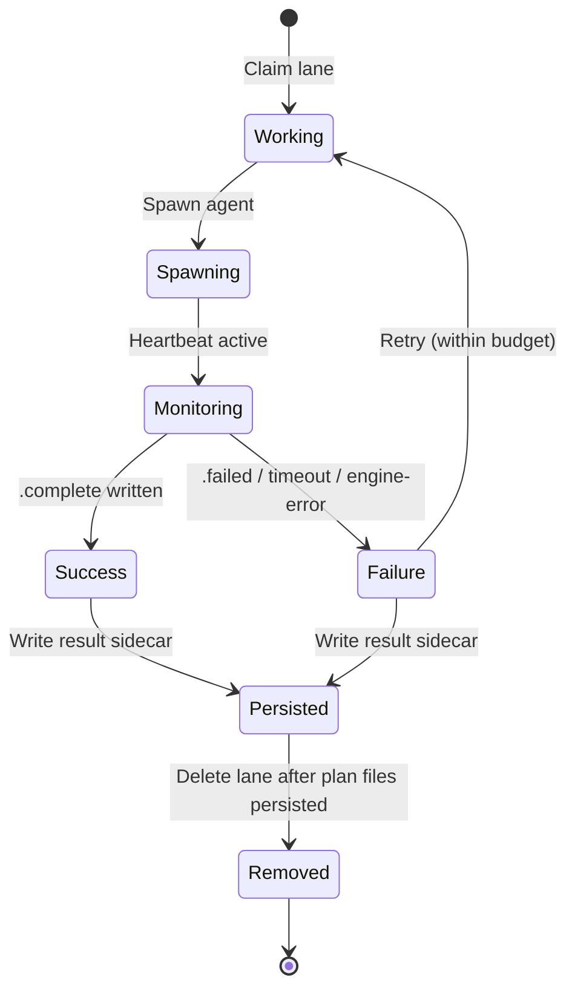

# Orchestrator architecture

Salmon Run is a file-oriented workflow engine for agentic development. Its design follows a small-tools pipeline: plans flow through interchangeable **ponds**, executors perform one bounded role, and a single coordinator owns control-plane state.

## Runtime pipeline at a glance

The default plan pipeline moves a plan through `Intake`, `Code`, `Review`, `Audit`, `QA`, `Complete`, and finally `Archive`. Semantic failures at `Review`, `Audit`, or `QA` return the plan to `Code` for bounded rework. `Project` plans decompose into child `Code` plans and a parent `ProjectReview` plan; once all children are `Complete`, the parent advances to `Complete`. Non-retryable or repeated failures, parser/transition exceptions, and exhausted retry budgets move the plan to `Paused` (or `Investigate` for recurring feedback cycles), with a final `Failed` fallback.

For each pond (except `Project`, `Complete`, and specialized stations), the engine runs the `Claim -> Prepare -> ModelRoute -> Spawn -> Monitor -> Transition` task pipeline. `Claim` reserves a working lane; `Prepare` copies plan files and checks evidence headers; `ModelRoute` resolves the `PondExecutionProfile`; `Spawn` starts the provider or local executor; `Monitor` polls the lane until the agent writes a sentinel, the process exits, or a timeout fires; and `Transition` atomically moves the plan, updates metadata, appends `PondLog` evidence, and enqueues a sync checkpoint.

A lane is created in `~/.salmon/Tasks/Working/<Lane>` when a plan is claimed. The lane is not removed until the plan `.md` file and result sidecar have been persisted and the transition has completed. On timeout, `Invoke-PondTaskMonitorStream` kills the tracked child process tree before the engine records a failure. On engine error, the transition fails closed to `Paused` rather than silently deleting state.

## Design boundaries

A plan is the data packet. A pond is a stage with the same conceptual interface:

1. accept eligible plans;
2. claim them under a generation-scoped lease;
3. run one role-specific executor;
4. emit a typed result;
5. let the coordinator choose the next pond.

Ponds do not own Git synchronization, recovery policy, or queue routing. That separation keeps stages replaceable: a local smoke-test executor, OpenCode, Devin, DSH, or Codex can implement a role without changing the orchestration protocol.

The coordinator is the only control-plane writer. It validates results, updates bounded current evidence, moves queue artifacts, renews/reaps leases, writes health events, and serializes Git synchronization.

## Durable state

| State | Location | Owner |
| --- | --- | --- |
| Plan specification and current semantic headers | `~/.salmon/Tasks/<Pond>/*.md` | Coordinator |
| Attempt result | `~/.salmon/Results/<PlanId>/<Gate>/<AttemptId>.json` | Executor writes; coordinator validates |
| Current gate result pointer | `~/.salmon/Results/<PlanId>/<Gate>/current.json` | Coordinator |
| Lane lease | `~/.salmon/Tasks/Working/<Lane>/.lease.json` | Coordinator/executor heartbeat |
| Retry and circuit-breaker state | `~/.salmon/State/plan-*.json` | Coordinator |
| Operational events | `~/.salmon/Logs/workflow-events.jsonl` | Coordinator and adapters |
| Pending Git synchronization | `~/.salmon/SyncOutbox/*.json` | Coordinator |

The plan specification is not an event log. Operational claim, spawn, heartbeat, checkpoint, push, and recovery events stay outside the agent packet. Semantic `PondLog` evidence is normalized to one block and bounded to the latest 32 outcomes.

## Pond catalog

Default ponds are defined in `Modules/SalmonRun.PondEngine/Public/Get-SalmonRunPonds.ps1`. The `OnFailure` column shows the default retry target; after `MaxRetries` the plan goes to `OnFailure.FinalMoveTo` (usually `Failed` or, for `Investigate`, `Intake`).

| Pond | Role | Entry Gate | OnSuccess | OnFailure | MaxRetries | Notes |
| --- | --- | --- | --- | --- | ---: | --- |
| `Intake` | `planner` | — | `Code` | `Paused` | 3 | Interactive intake; invalid plans go to `Paused`. |
| `Code` | `coder` | `ready` (`Status`, `Scope`) | `Review` | `Code` | 3 | Dependency-ready gate; semantic-failure loops back for rework. |
| `Review` | `reviewer` | `implemented` | `Audit` | `Code` | 3 | Read-only verification; failures return to `Code`. |
| `Audit` | `auditor` | `reviewed` | `QA` | `Code` | 3 | Best-practice and code-smell review. |
| `QA` | `qa` | `project-qa-ready` (`Status`, `Scope`) | `Complete` | `Code` | 3 | Batched property/mutation test maturation. |
| `Project` | `project-planner` | — | `ProjectReview` | — | 3 | Splits a large plan into child `Code` plans plus a parent `ProjectReview` plan. |
| `ProjectReview` | `project-reviewer` | `children-complete` | `Complete` | — | 3 | Waits for all child plans to reach `Complete`. |
| `Investigate` | `investigator` | `ready` (`Status`, `Scope`) | `Complete` | `Intake` | 3 | Spawns on recurring feedback failures; final fallback is `Intake`. |
| `Complete` | `archiver` | — | `Archive` | — | — | Compresses and archives plans older than 7 days. |

`Investigate` is the newest production gate. It runs the same `Claim -> Prepare -> ModelRoute -> Spawn -> Monitor -> Transition` pipeline as `Code` and `QA`, but its failure target is `Intake` so a failed investigation becomes a new planning task rather than another feedback cycle.

## Attempt and result protocol

Every gate attempt has stable `PlanId`, `AttemptId`, and `GateAttempt` values. A result record contains the gate, verdict, failure kind, timestamps, evidence summary, failed checks, fix actions, and changed-file scope.

Verdict precedence is attempt-scoped: the latest valid result is authoritative. Historical failures remain auditable but cannot override a later pass. Failure classification is total and uses these values:

- `success`
- `semantic-failure`
- `transport-failure`
- `timeout`
- `decision-required`
- `engine-error`

Parser or transition exceptions fail closed to `Paused` with `engine-error`; they never become implicit Code retries.

## Scheduling and writer isolation

Streams correspond to Git worktrees, while ponds correspond to roles. Scheduling resolves every repository/worktree to Git's common directory and uses that canonical identity as the writer lock.

Code, Audit, QA, Investigator, and code-changing recovery are mutually exclusive for a repository. Review can scale independently because it is read-only. A selected stream may only use a lane bound to the same canonical repository; there is no cross-repository fallback.

## Recovery

Recovery is deliberately narrower than retry. A lane is recoverable only when all of the following are true:

- its PID is dead;
- its typed heartbeat is stale;
- the lease generation is unchanged across two observations;
- no completed result sentinel exists.

Recovery preserves the source pond, attempt identity, and lease generation. Missing or malformed leases fail closed to `Paused/EngineError`. Completed lane envelopes are removed recursively before checkpoint work, so recovery can never observe a plan after its lease has been removed.

Retry budgets persist across restarts. Transport failures receive at most two backed-off retries; semantic failures receive at most two rework attempts. A repeated identical signature trips the breaker on its second occurrence. Six transitions without forward progress in 30 minutes pause the family.

## Git and synchronization

Claims, locks, and heartbeats are local atomic operations; they are not Git commits. Stable pond transitions are checkpointed as one move and placed in a serialized sync outbox. Fetch/reconcile/push happens outside lane execution.

An outbox request is idempotent. If its commit is already reachable from the remote branch, the coordinator acknowledges and removes it before considering backoff or working-tree state. Repeated sync failure opens dispatch backpressure rather than redispatching an agent.

## Health model

Process liveness is necessary but not sufficient. Health measures useful work: a unique plan advancing to a higher gate or completing. Claims, retries, rescues, heartbeat writes, and filename churn do not count as progress.

The health report includes unique completions, forward/backward transitions, cycles, transition errors, sync backlog/failures, duplicate families, largest prompt size, useful-run ratio, working-lane state, and coordinator heartbeat. Repeated cycling, transition exceptions, unsafe writer overlap, stale leases, prompt growth, or sync failure makes health fail closed.

## Extension contract

A new pond should be a narrow stage, not a second coordinator. Define its role, eligibility gate, executor contract, typed result, and success/failure destinations. Reuse the shared lease, result, repository identity, transition, journal, and outbox services. See [EXTENDING.md](./EXTENDING.md) for configuration examples.